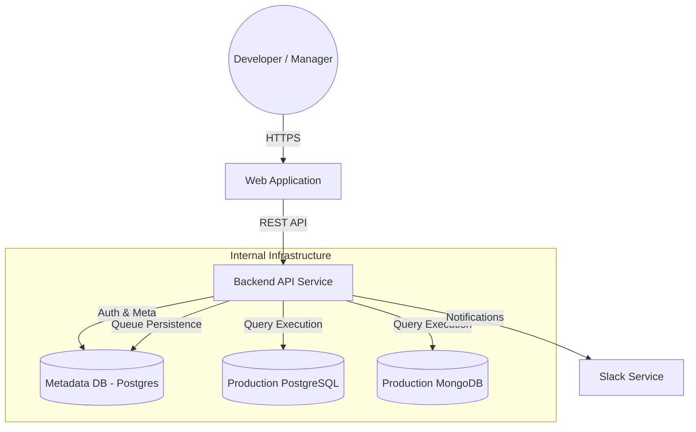
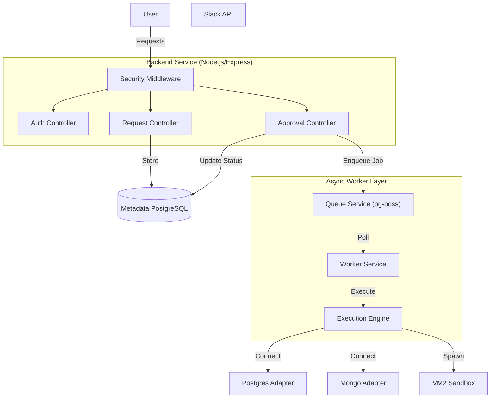
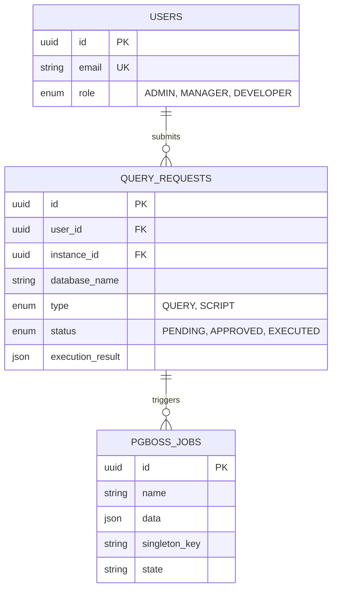
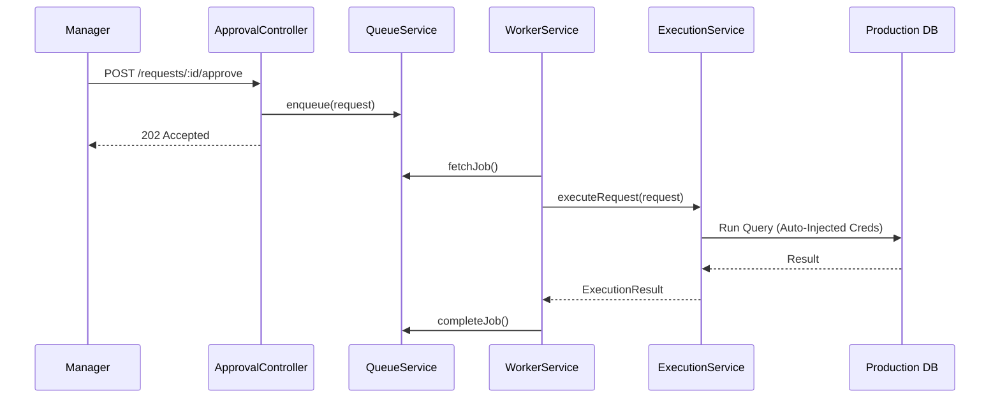
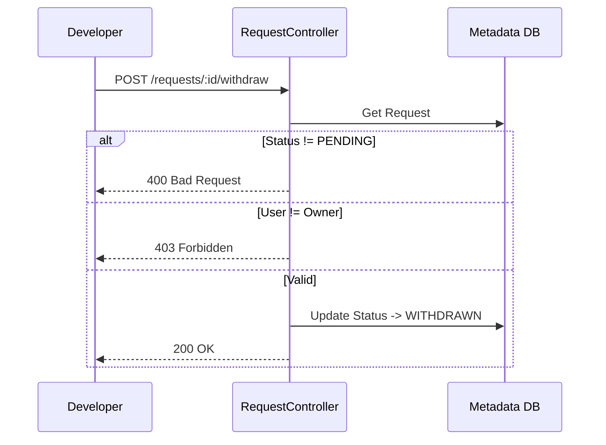
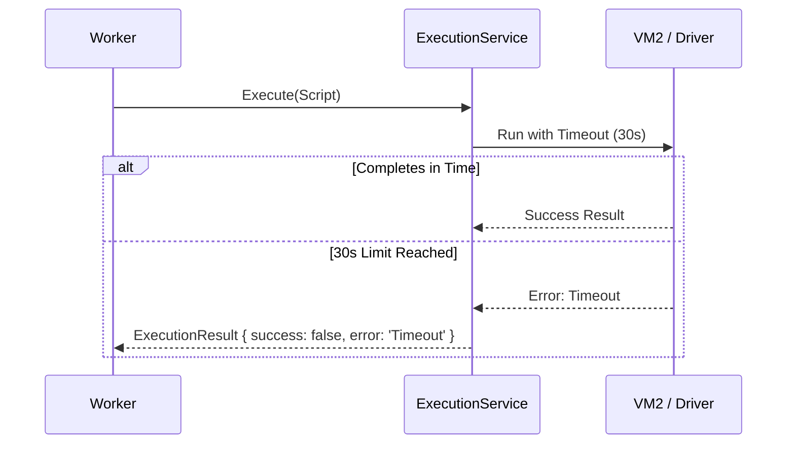
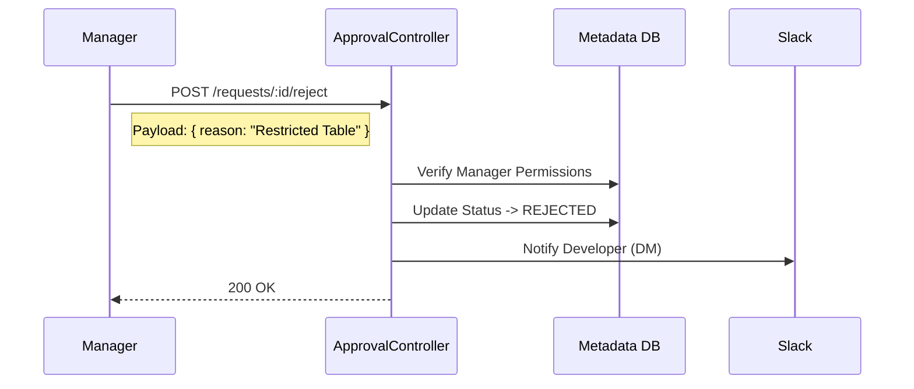

# Technical Requirements Document (TRD) - DB Query Portal

## 1. Executive Summary

The **DB Query Portal** is an enterprise-grade middleware solution designed to secure access to production databases. It acts as a Zero Trust proxy, eliminating the need for developers to hold direct database credentials. The system governs data access through strict Role-Based Access Control (RBAC), mandatory Manager Approvals, and immutable Audit Logging. It utilizes an asynchronous Job Queue to ensure ordered execution of queries against specific database instances.

---

## 2. System Architecture

The architecture decouples request submission from execution using a persistent job queue (`pg-boss`), ensuring reliability and First-In-First-Out (FIFO) ordering per database.

### 2.1 Context Diagram (C4 Level 1)

### 2.2 Container Diagram (C4 Level 2)

### 2.3 Connection Pooling & Caching Strategy
To maintain high performance and avoid exhausting database connection limits, the `ExecutionService` implements an internal caching layer:
*   **PostgreSQL:** Maintains a `Map<string, PostgresExecutor>`. The key is `postgres:${databaseName}`. Reuses the underlying `pg.Pool`.
*   **MongoDB:** Maintains a `Map<string, MongoExecutor>`. The key is `mongo:${databaseName}`. Reuses the `MongoClient`.
*   **Cleanup:** Connections are persistent but can be gracefully closed via `ExecutionService.cleanup()` during application shutdown.

---

## 3. Database Schema & Data Dictionary

The Metadata Database (PostgreSQL) is the source of truth for governance data and the persistence layer for the `pg-boss` job queue.

### 3.1 ER Diagram

### 3.2 Audit Log Event Dictionary
The system captures the following immutable events in the `AUDIT_LOGS` table:

| Category | Action | Description |
|---|---|---|
| **AUTH** | `LOGIN_SUCCESS` | User authenticated successfully. |
| **AUTH** | `LOGIN_FAILED` | Invalid credentials provided. |
| **AUTH** | `LOGOUT` | User explicitly logged out. |
| **ACCESS** | `FORBIDDEN_ACCESS` | User attempted action outside their permissions (e.g., Dev viewing Admin logs). |
| **REQUEST** | `REQUEST_CREATED` | New query/script submitted. |
| **REQUEST** | `REQUEST_WITHDRAWN` | User retracted their own pending request. |
| **APPROVAL**| `REQUEST_APPROVED` | Manager authorized execution. |
| **APPROVAL**| `REQUEST_REJECTED` | Manager denied request. |
| **EXECUTION**| `QUERY_EXECUTED` | Database query completed successfully. |
| **EXECUTION**| `EXECUTION_FAILED` | Database query failed or timed out. |

---

## 4. Key Security & Operational Concepts

### 4.1 Queue System & Ordering (The "Queue Key")
To prevent race conditions, the system enforces **Serialized Execution** per database instance.
*   **Queue Key:** `{db_type}:{instance_id}:{database_name}`
*   **Behavior:** Requests hitting the same key are processed FIFO.

### 4.2 Auto-Injection of Credentials
Zero Trust enforcement means credentials exist *only* in environment variables (`TARGET_*_URL`) and are injected at the *last possible millisecond*.

### 4.3 Input Sanitization & Validation

| Threat Vector | Mitigation Strategy | Implementation |
|---|---|---|
| **SQL Injection** | Detection & Parameterization | Regex scanning for keywords (`DROP`, `ALTER`). |
| **NoSQL Injection** | Operator Filtering | Rejects payloads containing `$where`, `$function`. |
| **XSS (Stored)** | Output Encoding | HTML entity encoding for display strings. |
| **Path Traversal** | Filename Cleaning | `sanitizeFileName` strips `..`, `/`. |
| **Malicious Scripts** | VM2 Sandboxing | `vm2` with blocked `fs`, `net` modules. |

### 4.4 Role-Based Access Control (RBAC) Matrix

| Feature | Admin | Manager | Developer |
|---|---|---|---|
| **Submit Request** | ✅ | ✅ | ✅ |
| **View Own requests** | ✅ | ✅ | ✅ |
| **View Team Requests** | ✅ (All) | ✅ (Own Pods) | ❌ |
| **Approve/Reject** | ✅ (All) | ✅ (Own Pods) | ❌ |
| **Withdraw Request** | ✅ (Own) | ✅ (Own) | ✅ (Own) |
| **Manage Users/Pods** | ✅ | ❌ | ❌ |
| **View Audit Logs** | ✅ | ❌ | ❌ |

---

## 5. Workflows & Sequence Diagrams

### 5.1 Approval & Asynchronous Execution Flow

### 5.2 Withdrawal Scenario (Edge Case)
Allows developers to retract a request *before* it is approved.

### 5.3 Execution Timeout Scenario
Prevents long-running queries from hanging the system.

### 5.4 Rejection Workflow
Managers can deny requests with a mandatory reason.

---

## 6. Environment Configuration & Limits

| Variable | Default | Description |
|---|---|---|
| `REQUEST_LIMIT_PER_USER` | 10 | Max PENDING requests a user can have. |
| `SCRIPT_TIMEOUT_MS` | 30000 | Hard timeout for execution. |
| `QUEUE_CONCURRENCY` | 5 | Number of parallel worker threads. |
