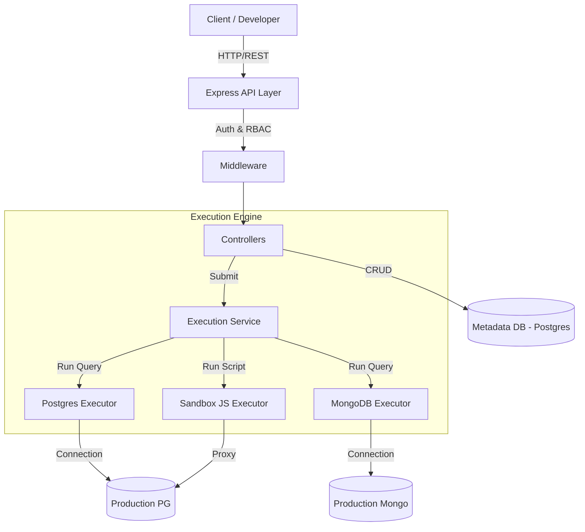
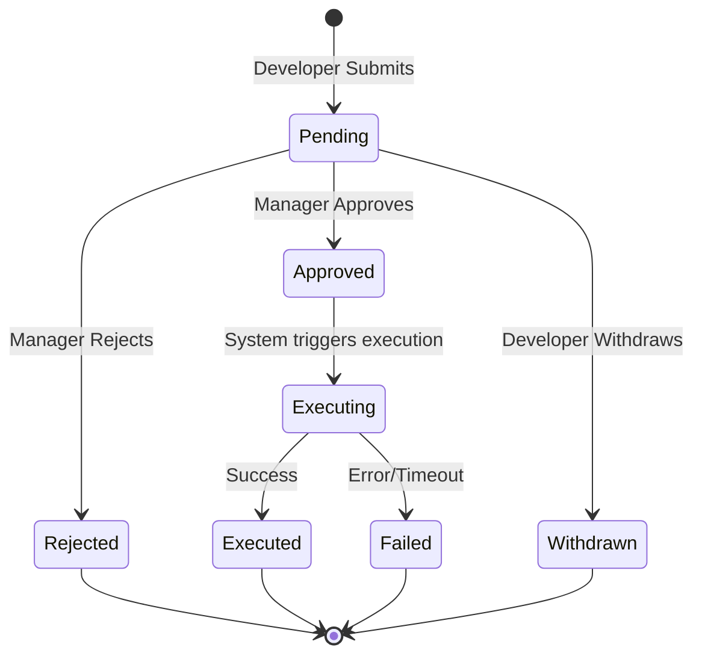

# System Architecture

## Overview
The Database Query Execution Portal is a centralised backend system enabling developers to query production databases safely. It acts as a proxy/middleman, ensuring no direct access credentials are shared with developers. All queries are subject to RBAC (Role-Based Access Control) and Manager Approval workflows.

## High-Level Design

## Core Components

### 1. API Layer (Node.js/Express)
- **Controllers**: Handle HTTP requests, parsing input.
- **Middleware**: 
    - `auth.middleware`: JWT verification.
    - `rbac.middleware`: Enforce Admin/Manager/Developer roles.
    - `validation.middleware`: Zod schema validation.
    - `rateLimiter`: Prevent abuse.

### 2. Metadata Database (PostgreSQL)
Stores system state, not the target data.
- **Users**: Credentials and Roles. (Table: `users`)
- **Pods**: Teams/Groups configuration. (Table: `pods`)
- **QueryRequests**: The core entity tracking a query from submission to execution. (Table: `query_requests`)
- **AuditLogs**: Immutable record of all actions. (Table: `audit_logs`)

### 3. Execution Service
The heart of the "proxy" functionality. It manages connections to target databases.
- **Connection Pooling**: Maintains pools for target DBs to reduce overhead.
- **Isolation**: Each request runs in its own context (scoped transaction or connection).
- **Execution**: 
    - **Postgres**: Uses `pg` driver. Sets `search_path`.
    - **Mongo**: Uses `mongodb` driver.
    - **Script**: Spawns a child process with restricted permissions (no `fs`, `net` access except whitelisted).

## Data Flow: Request Lifecycle

1.  **Submission**: Developer submits SQL/JS. System validates syntax and stores as `PENDING`.
2.  **Notification**: (Planned) Slack notification sent to POD channel.
3.  **Approval**: Manager reviews the query.
4.  **Execution**: On approval, the system:
    -   Retrieves target credentials (env vars).
    -   Connects to target DB.
    -   Runs query with timeout.
    -   Captures result/error.
    -   Updates status to `EXECUTED` or `FAILED`.

## Security Architecture

### Zero Trust
- Developers NEVER possess production DB credentials.
- Backend injects credentials only at execution time.

### Sandboxing (Script Execution)
- Scripts run in a separate Node.js child process.
- **Context Isolation**: `vm2` or manual context isolation usage.
- **Restricted Modules**: `fs`, `child_process` are blocked.
- **Timeouts**: Hard limit (default 30s) to prevent DoS.

### Audit Logging
Every significant action (Login, Submit, Approve, Execute) is logged to `audit_logs` table. This provides a tamper-evident trail for compliance.
